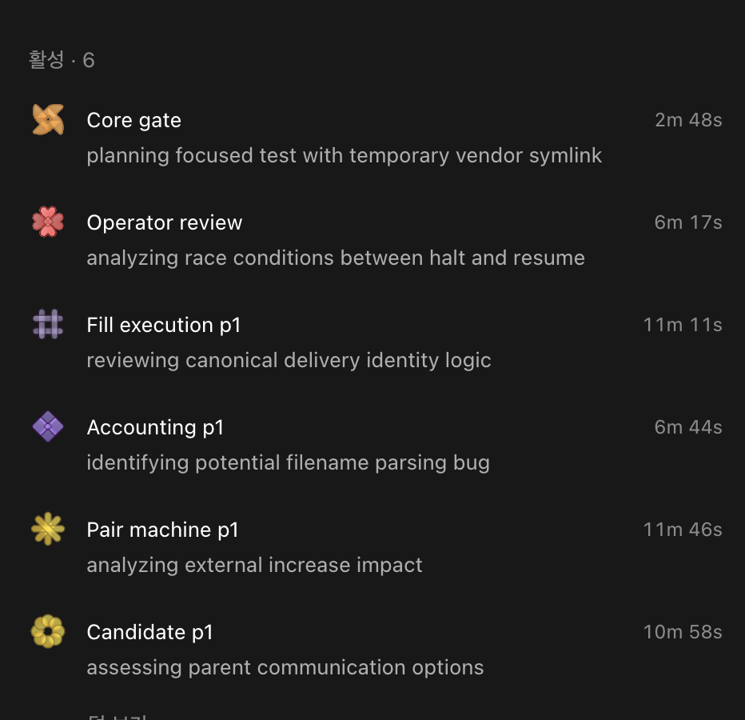

# Luna_1M_Ultra

[English](./README.md) | [한국어](./README.kr.md)

GPT-6 Luna를 기본 모델로 사용하는 경량 Codex 멀티 에이전트 구성 및 프롬프트/라우팅 프로필입니다.

- **Luna Max** — 오케스트레이션, 구현, 디버깅, 테스트, 검토에 최대 추론을 사용하는 기본 모델이자 기본 작업자 `gpt-6-luna`
- **Astra** — 더 높은 역량의 모델이 필요한 작업에서 명시적으로 선택할 수 있는 선택적 에스컬레이션 `gpt-6-astra`

`Luna_1M_Ultra`(또는 “Luna Ultra”)는 여기에 설명된 프롬프트, 역할, 컨텍스트, 라우팅 동작을 가리키는 개념적 프로필 이름입니다. 모델 ID나 공식 모델 상품이 아닙니다. 구성된 Luna 모델은 `gpt-6-luna`입니다.

이 저장소는 프로필 문서를 독립적으로 공개 복제한 것이며, 동일 계정의 Git 포크가 아닙니다.

이 저장소의 모든 문서에는 한국어 대응 문서가 있습니다. Markdown 번역본에는 `.kr.md` 접미사를 사용합니다. `LICENSE.kr`은 비공식 번역본이며, 영어 라이선스가 기준 문서입니다.

이 프로필은 GPT-6 Luna를 기본 세션이자 기본 위임 모델로 유지합니다. 미리 정의된 네 가지 Luna 역할을 리프 작업자로 사용하며, 사소하지 않은 작업에서 속도나 범위를 개선할 독립 작업 흐름을 선제적으로 위임합니다.

## 이 구성의 배경

일반적인 멀티 에이전트 패턴에서는 오케스트레이션과 구현 사이에 여러 모델 계층을 추가합니다. 이 방식은 컨텍스트를 중복하고, 저장소 탐색을 반복하며, 인계에 드는 부담을 늘릴 수 있습니다.

이 구성은 계층을 단순하게 유지합니다.

```text
Luna Max 기본 세션 (`gpt-6-luna`; `max` 추론)
├─ luna_medium (`gpt-6-luna`)  → 범위가 한정된 분석 및 조회
├─ luna_high (`gpt-6-luna`)    → 국소 수정 / 일상적인 점검
├─ luna_max (`gpt-6-luna`)     → 구현 / 어려운 디버깅
└─ luna_review (`gpt-6-luna`)  → 독립적인 검토
```

GPT-6 Luna는 효율적이고 집중도 높은 대량 작업을 위해 설계되었습니다. 기본 모델은 서로 독립적인 작업을 미리 정의된 역할에 배정하고 결과를 종합할 수 있습니다.

## 주요 기능

- 최상위 오케스트레이터는 Luna Max 하나로 구성
- 위임되는 리프 에이전트는 Luna만 사용
- 필요성이 있는 작업에서 명시적으로 선택하는 선택적 모델로 Astra 제공
- `Luna_1M_Ultra`는 모델 ID가 아니라 개념적인 프롬프트/라우팅 프로필
- 전역 기본 요청값은 `model_context_window = 1_000_000`, `model_auto_compact_token_limit = 900_000`
- 미리 정의된 네 가지 Luna 역할은 전역 컨텍스트 및 압축 기본값을 상속합니다: `medium`, `high`, `max`, `review`
- GPT-6 Luna의 공식 컨텍스트 윈도는 1.05M입니다. 현재 설치된 Codex 카탈로그에서는 이를 `max_context_window = 872_000`으로 제한하며, 런타임에서 실제 적용되는 압축 한도는 `828_400`입니다.
- 조사 → 구현 → 테스트 → 수정 과정에서 컨텍스트 재사용
- 사소하지 않은 작업은 선제적으로 위임하며, 구현이 하나의 주된 경로를 따르더라도 독립 분석이나 검증을 수행
- 필수 추론 단계 사다리 없음
- Sol/Terra 에스컬레이션 계층 없음
- 별도의 읽기 전용 검토 역할

## 설정

[Luna_1M_Ultra_Setup.md](./Luna_1M_Ultra_Setup.md)를 참조하세요.

최소한 다음 설정을 추가합니다.

```toml
model = "gpt-6-luna"
model_reasoning_effort = "max"
plan_mode_reasoning_effort = "max"
review_model = "gpt-6-luna"
model_context_window = 1_000_000
model_auto_compact_token_limit = 900_000

[desktop]
followUpQueueMode = "queue"
show-context-window-usage = true
enabled-reasoning-efforts = ["low", "medium", "high", "xhigh", "persistent", "max", "ultra"]

[tui]
status_line = ["model-with-reasoning", "context-remaining", "current-dir"]

[agents]
enabled = true
default_subagent_model = "gpt-6-luna"
default_subagent_reasoning_effort = "max"
max_concurrent_threads_per_session = 12
max_depth = 1

[features.multi_agent_v2]
expose_spawn_agent_model_overrides = true
```

`~/.codex/agents/` 아래의 네 역할 파일은 위의 전역 컨텍스트 및 압축 설정을 상속하며, 어느 설정도 덮어쓰지 않습니다. 각 역할은 `gpt-6-luna`를 사용합니다. 프로필 이름이 모델 ID를 대체하지는 않습니다. 설정에 정의된 역할은 다음과 같습니다.

```text
~/.codex/agents/
├── luna_medium.toml
├── luna_high.toml
├── luna_max.toml
├── luna_review.toml
```

`expose_spawn_agent_model_overrides = true`를 설정하면 오케스트레이터에 `spawn_agent` 모델 재정의 제어 항목이 표시됩니다. 이는 구성 선택지를 노출하는 것이며, 숨겨진 사고 과정을 노출하는 것은 아닙니다.

GPT-6 Luna는 `max`까지 추론을 지원하므로 기본 모델과 `luna_max` 역할은 `max`를 사용합니다. 모델 선택기에는 이를 지원하는 모델을 위해 `ultra`도 활성화되어 있지만, GPT-6 Luna는 `ultra`를 지원하지 않습니다.

네 가지 역할 이름은 미리 정의된 작업 유형입니다. 사소하지 않은 작업에서는 기본 모델이 유용한 독립 작업 흐름을 적합한 역할에 선제적으로 배정합니다. 스크린샷은 동시에 실행된 작업 단위가 여섯 개였음을 보여 주며, 역할 정의가 여섯 개임을 뜻하지 않습니다.

TUI 바닥글에는 활성 모델과 추론 수준, 남은 컨텍스트, 현재 디렉터리가 표시됩니다. `context-remaining` 항목을 사용하면 컨텍스트 사용량 UI가 활성화됩니다.

이 설정에서는 앱의 Settings > General > Context length usage 토글이 활성화되어 있습니다. 해당 구성 키는 `[desktop].show-context-window-usage = true`이며, 터미널의 `tui.status_line`과는 별개입니다. 현재 데스크톱 빌드에서는 게이지를 표시하려면 세션의 컨텍스트 사용률이 있어야 하고 작성 영역의 폭도 충분해야 합니다. 활성화했는데도 표시되지 않으면 앱 창을 넓히거나 사이드바를 접으세요. [Codex 설정 예시](https://learn.chatgpt.com/docs/config-file/config-sample)를 참조하세요.

후속 프롬프트의 기본 동작은 `queue`이므로 현재 실행이 끝날 때까지 추가 프롬프트가 대기합니다. `followUpQueueMode = "queue"`를 사용하세요. `stack`은 지원되지 않습니다. 앱의 Settings > General에서도 Queue와 Steer를 선택할 수 있습니다. [데스크톱 설정](https://learn.chatgpt.com/docs/reference/settings)을 참조하세요.

## 역할 선택

| 역할 | 추론 수준 | 컨텍스트 | 사용 사례 |
|---|---:|---:|---|
| `luna_medium` | medium | 전역 기본값 | 흐름 추적, 로그, 의존성 |
| `luna_high` | high | 전역 기본값 | 소규모 수정, 일상적인 테스트 |
| `luna_max` | max | 전역 기본값 | 실질적인 구현, 어려운 디버깅 |
| `luna_review` | xhigh | 전역 기본값 | 독립적인 심층 검토 |

이 역할은 **순차적인 단계가 아니라 작업 유형입니다**.

사소하지 않은 모든 작업에서 Luna Max는 속도나 범위 개선에 도움이 되는 경우 독립적인 조사, 구현, 테스트, 검토 작업을 별도의 동시 Luna 작업 흐름으로 선제적으로 나눕니다. 사소하지 않은 작업이지만 단일 흐름으로 진행되는 경우에도 가치가 있다면 유용한 독립 분석 또는 검증 작업을 하나 이상 위임합니다. 서로 의존하는 단계는 순차적으로 실행하고 선행 작업이 끝날 때까지 기다립니다. 단순한 단일 단계 작업, 분리할 수 없거나 기본 모델의 컨텍스트에서만 처리해야 하는 작업, 안전/개인정보 보호 또는 동시 수정 충돌이 우려되는 경우, 또는 위임이 이점을 주지 않는 경우에만 위임을 생략합니다.
기본 위임 역할은 최대 추론을 사용하는 `gpt-6-luna`의 `luna_max`입니다. 범위와 권한에 더 적합하다면 다른 미리 정의된 역할을 직접 선택하세요.

유용하게 독립된 작업 흐름이 있는 만큼, 설정된 세션당 동시 스레드 한도 12개까지 사용하세요. `max_concurrent_threads_per_session = 12`는 상한이지 목표 수가 아니며, 이 값을 설정한다고 에이전트가 자동으로 시작되는 것도 아닙니다. 여섯 개나 다른 고정된 수를 목표로 삼거나, 형식적인 작업자를 추가하거나, 범위가 중복되게 하거나, 서로 겹치는 수정을 허용하지 마세요. Luna Max가 오케스트레이션, 의사 결정, 통합, 최종 승인을 담당하며 위임된 Luna 역할은 리프 작업자로 남습니다.

위임 동작, 역할, 동시 실행 설정은 공식 [Codex 서브에이전트 가이드](https://learn.chatgpt.com/docs/agent-configuration/subagents)를 참조하세요.

## 병렬 실행 사례

첨부된 실행 스냅샷에는 서로 독립적인 작업 단위 여섯 개가 동시에 활성화된 모습이 담겨 있습니다. 여섯 개는 이 예시에서 관찰된 수일 뿐, 고정된 목표나 필수 작업자 수가 아닙니다. 유용한 독립 작업의 수에 따라 정하고 설정된 상한을 넘지 마세요.



| 작업 단위 | 사용 사례 | 관찰된 소요 시간 |
|---|---|---:|
| 핵심 게이트 | 임시 vendor 심볼릭 링크를 사용하는 계획 중심 테스트 | 2m 48s |
| 운영자 검토 | 중단과 재개 사이의 경쟁 조건 분석 | 6m 17s |
| 체결 실행 p1 | 정식 전달 식별 로직 검토 | 11m 11s |
| 회계 p1 | 잠재적인 파일명 파싱 버그 식별 | 6m 44s |
| 페어 머신 p1 | 외부 증가의 영향 분석 | 11m 46s |
| 후보 p1 | 상위 구성 요소와의 커뮤니케이션 방안 평가 | 10m 58s |

제공된 Pro 5X 관찰값에 따르면 이러한 유형의 집중 실행 중 주간 사용량 한도는 5분마다 약 1%씩 소진됩니다. 이는 계획 수립을 위한 관찰 참고값이며, 공식 할당량이나 요금 약속 또는 보장된 사용률로 간주하지 마세요.

## 컨텍스트 정책

- 관련 작업에는 기존 Luna 작업자를 재사용합니다.
- 서로 관련 없는 일회성 작업은 새 작업 흐름으로 시작합니다.
- 저렴한 Luna 입력 토큰을 아끼려고 빈 컨텍스트를 강제하지 않습니다.
- 전역 기본 컨텍스트 윈도가 있다고 해서 이를 가득 채우지 않습니다.
- Luna 작업자는 리프 역할로 유지하며 서브에이전트를 생성하지 않습니다.
- Luna 역할이 해결되지 않는 중대한 결정에 도달하면 기본 Luna Max가 결정하거나, 에스컬레이션 대상으로 Astra를 명시적으로 선택할 수 있습니다.

## GitHub 라우팅

- 사소하지 않은 저장소 및 GitHub 작업은 광범위한 탐색, 구현, 디버깅, 테스트에 앞서 적합한 Luna 작업자에게 선제적으로 위임합니다. 가능하다면 기존의 유용한 작업자를 재사용합니다.
- `luna_max`는 저장소 검색, diff 분석, 코드 또는 문서 변경, 테스트, GitHub CLI 준비, 이슈/PR 초안 작성의 기본 위임 작업자입니다. 작업과 권한에 맞는 경우 `luna_medium`, `luna_high`, `luna_review`를 직접 선택하세요.
- 독립적인 조사, 구현 단위, 테스트 모음, 검토는 여러 작업자에게 나눠 동시에 진행합니다. 사소하지 않은 작업이 단일 작업 흐름으로 진행되더라도 결과 개선에 도움이 된다면 유용한 독립 검증 또는 분석 작업을 추가합니다. 서로 의존하는 단계는 순차적으로 진행하고 선행 작업이 끝날 때까지 기다립니다.
- Luna Max가 작업 범위 설정, 최종 범위 확정, 통합, 승인을 담당하며 Astra는 명시적으로 선택하는 선택적 에스컬레이션입니다.
- 작업자들이 실행 중일 때 Luna Max는 같은 범위의 작업을 반복하지 않습니다. 독립된 작업 단위는 Luna에 병렬로 위임할 수 있습니다.
- 비밀 정보, 로컬 구성, 자격 증명 또는 검토되지 않은 백로그를 절대 공개하지 않습니다.

## 호환성 참고

전역 Codex 구성은 GPT-6 Luna 기본 세션과 미리 정의된 네 역할 모두에 `model_context_window = 1_000_000`, `model_auto_compact_token_limit = 900_000`을 요청합니다. GPT-6 Luna의 공식 컨텍스트 윈도는 1.05M이지만, 현재 설치된 Codex 모델 카탈로그에는 `max_context_window = 872_000`, 런타임에서 실제 적용되는 압축 한도에는 `828_400`이 표시됩니다. 역할 파일은 전역 컨텍스트 설정을 상속합니다.

## 라이선스

MIT 라이선스: [영문 원문](./LICENSE) | [비공식 한국어 번역](./LICENSE.kr). 충돌 시 영문 원문이 우선합니다.
